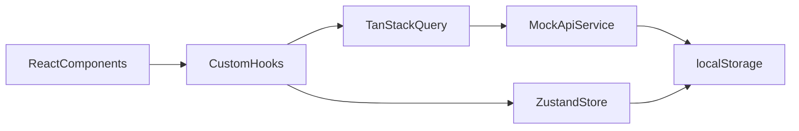

# Crypto Coin Flip Bet Simulator

A polished React + TypeScript casino-style simulator for coin flip betting with crypto balances.

## Features

- Coin flip game with true 50/50 outcome (`heads` / `tails`)
- Multi-currency balances: `BTC`, `ETH`, `SOL` (starts at 1000 each)
- Place manual bets with amount validation and balance checks
- Auto-bet Martingale strategy:
  - doubles bet after loss
  - resets to base bet after win
  - supports stop-win and stop-loss thresholds
- Recent bet history (last 20 bets)
- History filtering:
  - win/loss filter
  - currency filter
  - min/max amount filter
  - debounced search
- Statistics:
  - total bets
  - win/loss ratio
  - biggest win/loss
  - current net P/L
- Loading, error, and retry states
- Toast notifications for outcomes and failures
- Local persistence via `localStorage`

## Tech Stack

- React + TypeScript + Vite
- TanStack Query (React Query) for server state and API integration
- Zustand for client-side game/filter settings
- Tailwind CSS (dark polished UI)
- ESLint + Prettier

## Architecture



## Project Structure

```txt
src/
  api/
    mockApi.ts
    storage.ts
    types.ts
  hooks/
    useBetHistory.ts
    useBetSimulation.ts
    useDebounce.ts
    useUser.ts
  store/
    gameStore.ts
    filterStore.ts
  components/
    BetPanel/
    History/
    Stats/
    ui/
  pages/
    Home.tsx
  lib/
    format.ts
    queryClient.ts
  App.tsx
  main.tsx
```

## Getting Started

### Prerequisites

- Node.js 18+
- npm 9+

### Install

```bash
npm install
```

### Run development server

```bash
npm run dev
```

Open the app at [http://localhost:5173](http://localhost:5173).

### Build for production

```bash
npm run build
```

### Preview production build

```bash
npm run preview
```

### Lint

```bash
npm run lint
```

## Mock API Notes

The mock API simulates network behavior:

- latency: random delay (~220–520ms)
- occasional failures (~2%) to verify error handling
- local persistence for:
  - user balances
  - bet history
  - schema versioning

## Persistence Keys

- `user` — user and balances
- `history` — last 20 bets
- `settings` — persisted game settings (Zustand)

## Important Behavior

- Winning a bet returns **2x** of stake (net +1x)
- Losing a bet loses full stake
- Auto-bet only continues while thresholds and balance conditions are valid
- History always keeps the latest 20 bets only
